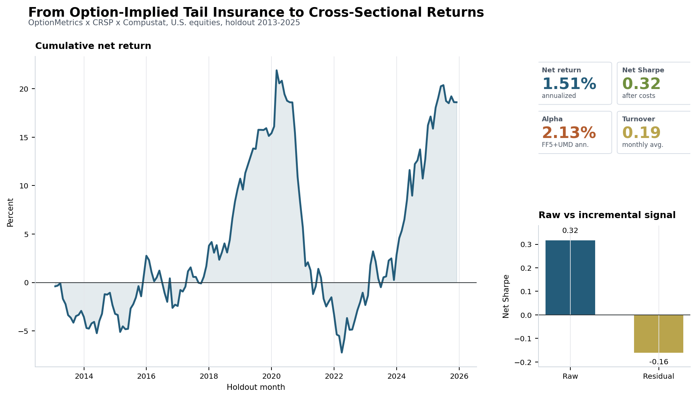
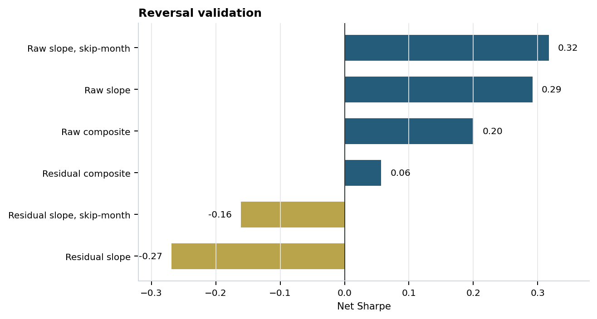
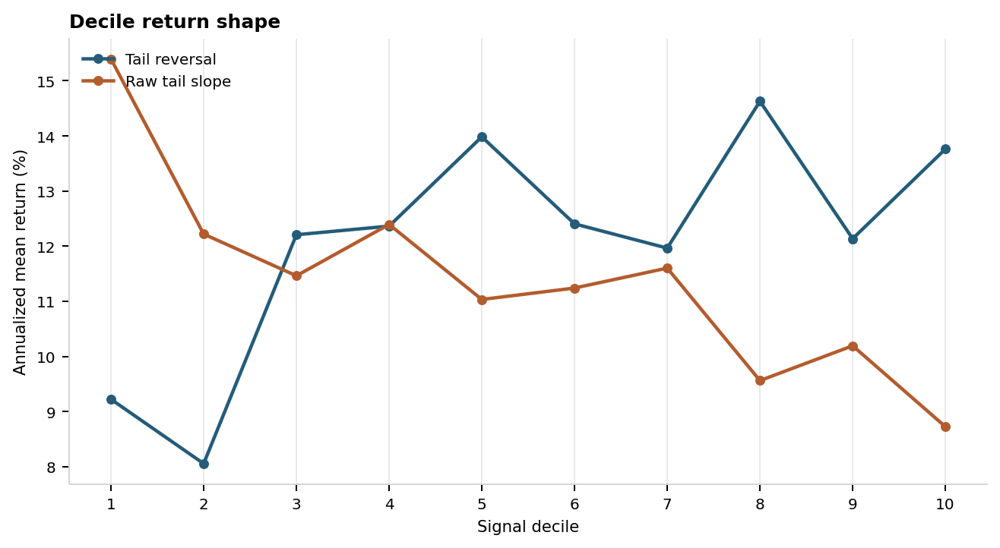
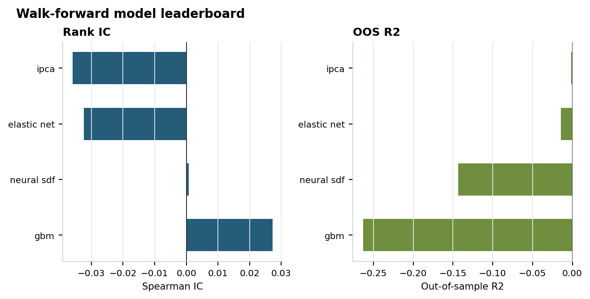
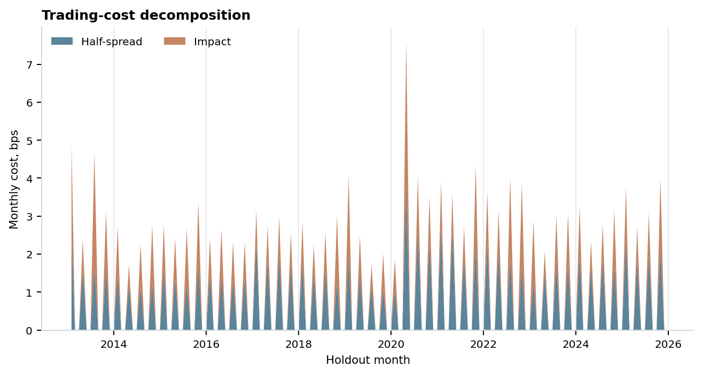
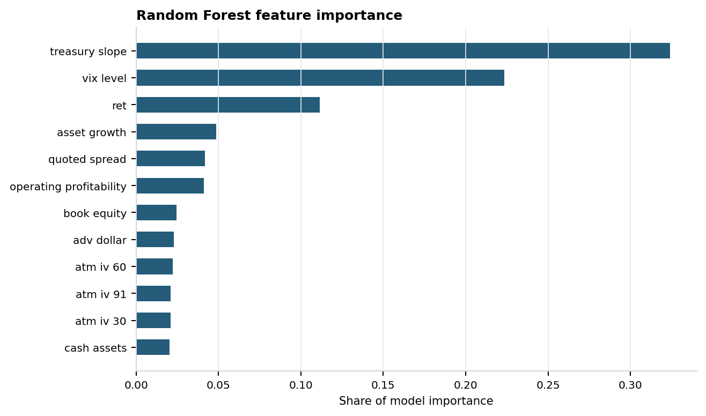
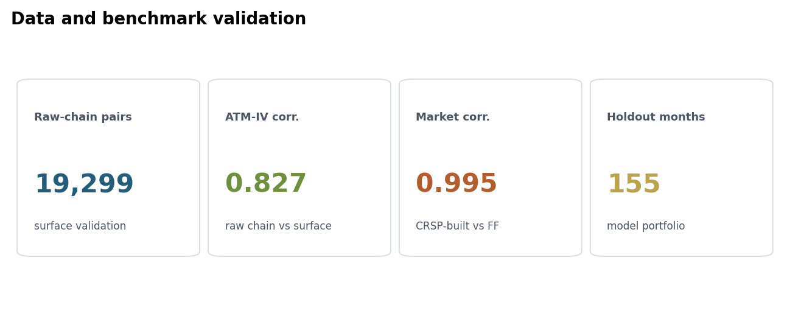
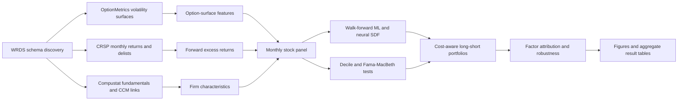

# Conditional Tail-Risk Pricing

Do single-stock option surfaces contain information about the cross-section of future equity returns?

This repository answers that question with a WRDS-scale empirical asset-pricing pipeline that links OptionMetrics IvyDB US volatility surfaces to CRSP returns, Compustat fundamentals, Fama-French factors, Cboe VIX states, walk-forward ML models, transaction-cost-aware portfolios, and factor attribution.




## Headline Answer

The strongest return signal is not a simple "expensive downside insurance earns a premium" story. The data point to a reversal-style pattern: stocks with unusually expensive downside-tail insurance tend to underperform lower-tail-expense names, and the signal is most usable when traded slowly in the liquid universe.

| Item | Result |
|---|---:|
| Full feature store | 1,622,696 stock-months |
| Effective data coverage | 1996-01 to 2025-12 |
| Holdout sample | 609,605 stock-months |
| Selected strategy | Tail-slope reversal, liquid universe, quarterly smoothing, 1-month skip |
| Net annualized return | 1.51% |
| Net Sharpe | 0.32 |
| FF5+UMD monthly alpha | 0.00177 |
| FF5+UMD alpha t-stat | 1.15 |
| Average monthly turnover | 0.19 |
| Raw-chain ATM-IV validation correlation | 0.827 |
| CRSP-built market vs FF market correlation | 0.995 |

The result is modest in magnitude, but the project is deliberately broad: it builds the data stack, tests the option-surface signal from several angles, evaluates ML forecasts out of sample, validates surface measures against raw option chains, decomposes trading costs, and attributes returns to standard factors.

## Visual Results

| Strategy validation | Portfolio shape |
|---|---|
|  |  |
| Skip-month and residualized variants of the tail-slope reversal signal. | Decile returns for tail-risk and reversal signals across liquidity and state screens. |

| Model and signal diagnostics | Cost and attribution |
|---|---|
|  |  |
| Out-of-sample model comparison across return-forecasting tracks. | Gross-to-net performance under turnover, half-spread, and impact costs. |

| Feature importance | Data validation |
|---|---|
|  |  |
| Random Forest feature importance for return-forecast inputs. | Surface, benchmark, and holdout checks summarized from the run. |

## Pipeline Architecture



## What This Project Demonstrates

| Area | Implementation |
|---|---|
| Data engineering | WRDS schema discovery, restartable extracts, CRSP/Compustat/OptionMetrics joins, local cache discipline |
| Empirical asset pricing | Decile sorts, Fama-MacBeth tests, factor attribution, FF25 spanning diagnostics |
| Options data | Surface-based IV, skew, tail-slope, term-structure, curvature, and raw-chain validation |
| Financial ML | Elastic net, gradient boosting, IPCA-style factor model, GPU-enabled neural SDF |
| Backtesting | Walk-forward splits, no look-ahead labels, turnover-aware long-short construction, cost grids |
| Research communication | Aggregate result tables, publication-ready figures, notebooks, CI, data-access documentation |

## Reproducibility

Install the package and run the pipeline commands from the repository root:

```bash
python -m pip install -e ".[dev,ml]"

python -m ctrsdf.pipeline schema-audit --config configs/project.yaml
python -m ctrsdf.pipeline smoke --config configs/project.yaml
python -m ctrsdf.pipeline full --config configs/project.yaml
python -m ctrsdf.pipeline results --config configs/project.yaml
python -m ctrsdf.pipeline figures --config configs/project.yaml

python -m pytest
python -m ctrsdf.utils.secret_audit --root .
```

Main Amarel entry points are in `scripts/amarel/`:

```text
run_schema_audit.sh
run_smoke.sh
run_full.sh
run_results.sh
run_tests.sh
submit_existing_allocation.ps1
```

## Repository Map

```text
surface-to-returns-asset-pricing/
├── README.md
├── DATA_ACCESS.md
├── configs/
│   └── project.yaml
├── docs/
│   ├── assets/
│   │   ├── figures/
│   │   └── tables/
│   └── replication.md
├── notebooks/
│   ├── 01_data_audit.ipynb
│   ├── 02_benchmark_reconciliation.ipynb
│   ├── 03_feature_diagnostics.ipynb
│   ├── 04_baseline_models.ipynb
│   ├── 05_ml_models.ipynb
│   ├── 06_sdf_results.ipynb
│   └── 07_paper_figures.ipynb
├── scripts/
│   ├── amarel/
│   ├── describe_wrds_tables.py
│   ├── probe_option_surface_grid.py
│   └── probe_wrds_tables.py
├── sql/
│   └── wrds/
├── src/
│   └── ctrsdf/
└── tests/
```

## Published Aggregate Outputs

The repository includes rendered figures and aggregate CSV summaries under `docs/assets/`.

Key tables:

```text
docs/assets/tables/headline_results.csv
docs/assets/tables/reversal_validation.csv
docs/assets/tables/strategy_variants.csv
docs/assets/tables/decile_shape.csv
docs/assets/tables/factor_attribution.csv
docs/assets/tables/feature_importance.csv
```

Key figures:

```text
docs/assets/figures/headline_surface_to_returns.png
docs/assets/figures/reversal_validation.png
docs/assets/figures/decile_shape.png
docs/assets/figures/model_leaderboard.png
docs/assets/figures/feature_importance.png
docs/assets/figures/cost_decomposition.png
docs/assets/figures/validation_scorecard.png
```

## Data Access

The code expects licensed access to WRDS, CRSP, Compustat, OptionMetrics, Fama-French data, Cboe/VIX data, and rate-state inputs. The repository includes SQL, configs, scripts, tests, notebooks, aggregate summaries, and rendered figures. It does not redistribute raw vendor rows, protected local caches, credentials, server logs, or detailed row-level model panels.

See `DATA_ACCESS.md` for the dataset map and credential-handling expectations.

## License

Code is released under the MIT License. Figures and documentation are intended for research presentation. Third-party datasets remain governed by their original data licenses.
